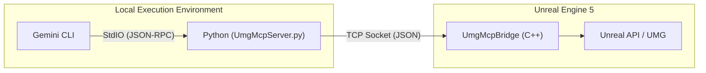

> **This is a fork of [winyunq/UnrealMotionGraphicsMCP](https://github.com/winyunq/UnrealMotionGraphicsMCP).** Modified for UE 5.7 compatibility and enhanced widget features.

# UE5-UMG-MCP 🤖📄

**A Version-Controlled AI-Assisted UMG Workflow**

---

## Supported MCP Tools

### UMG - Introspection

| Tool | Description | Parameters |
|------|-------------|------------|
| `get_widget_schema` | Retrieves the property schema for a widget type | `widget_type: str` |
| `get_creatable_widget_types` | Returns a list of common creatable widget types | *(none)* |

### UMG - Attention & Context

| Tool | Description | Parameters |
|------|-------------|------------|
| `get_target_umg_asset` | Gets the current Active Target asset path | *(none)* |
| `get_last_edited_umg_asset` | Gets the last edited UMG asset path | *(none)* |
| `get_recently_edited_umg_assets` | Gets a list of recently edited UMG assets | `max_count: int = 5` |
| `set_target_umg_asset` | Sets the Active Target. Creates the asset if it doesn't exist. Supports specifying parent class for new assets | `asset_path: str`, `parent_class: str = None` (e.g. `/Script/YourModule.YourWidget`) |

### UMG - Sensing (Read)

| Tool | Description | Parameters |
|------|-------------|------------|
| `get_widget_tree` | Fetches the full widget hierarchy of the Active Target | *(none)* |
| `query_widget_properties` | Reads specific properties from a widget | `widget_name: str`, `properties: List[str]` |
| `get_layout_data` | Gets screen-space bounding boxes for widgets | `resolution_width: int = 1920`, `resolution_height: int = 1080` |
| `check_widget_overlap` | Checks for visual overlaps between widgets | `widget_names: List[str] = None` |

### UMG - Action (Write)

| Tool | Description | Parameters |
|------|-------------|------------|
| `create_widget` | Creates a new widget under a parent | `parent_name: str`, `widget_type: str`, `new_widget_name: str` |
| `set_widget_properties` | Modifies properties of an existing widget | `widget_name: str`, `properties: Dict` |
| `delete_widget` | Removes a widget from the tree | `widget_name: str` |
| `reparent_widget` | Moves a widget to a new parent | `widget_name: str`, `new_parent_name: str` |
| `save_asset` | Saves the current asset to disk | *(none)* |

### UMG - File Transformation

| Tool | Description | Parameters |
|------|-------------|------------|
| `export_umg_to_json` | Converts a UMG asset to JSON | `asset_path: str`, `widget_name: str = "Root"` |
| `apply_layout` | Applies a bulk layout (HTML or JSON format) | `layout_content: str`, `widget_name: str = "Root"` |

### Animation & Sequencer

| Tool | Description | Parameters |
|------|-------------|------------|
| `set_animation_scope` | Sets the Active Animation scope for subsequent commands | `animation_name: str` |
| `set_widget_scope` | Sets the Active Widget scope within the current animation | `widget_name: str` |
| `get_all_animations` | Lists all animations in the asset | *(none)* |
| `get_animation_keyframes` | Gets keyframes for an animation | `animation_name: str` |
| `get_animated_widgets` | Gets widgets affected by an animation | `animation_name: str` |
| `get_animation_full_data` | Gets complete animation data | `animation_name: str` |
| `get_widget_animation_data` | Gets animation data for a specific widget | `animation_name: str`, `widget_name: str` |
| `create_animation` | Creates a new animation | `animation_name: str` |
| `delete_animation` | Deletes an animation | `animation_name: str` |
| `set_property_keys` | Sets keyframes on a property | `property_name: str`, `keys: List[Dict]` |
| `remove_property_track` | Removes a property track from the scoped widget | `property_name: str` |
| `remove_keys` | Removes specific keyframes by time | `property_name: str`, `times: List[float]` |

### Blueprint

| Tool | Description | Parameters |
|------|-------------|------------|
| `set_edit_function` | Sets the active function/graph context (e.g., 'EventGraph') | `function_name: str` |
| `set_cursor_node` | Explicitly sets the Program Counter to a node | `node_id: str` |
| `get_function_nodes` | Lists all nodes in the active function/graph | *(none)* |
| `add_step` | Adds an executable node to the current Program Counter | `name: str`, `args: List = None`, `comment: str = None`, `input_wires: Dict = None` |
| `prepare_value` | Places a non-executable data node (e.g., variable getter) | `name: str`, `args: List = None` |
| `connect_data_to_pin` | Connects nodes via `NodeID:PinName` format | `source: str`, `target: str` |
| `add_variable` | Adds a member variable to the blueprint | `name: str`, `type: str`, `subType: str = None` |
| `delete_variable` | Deletes a member variable | `name: str` |
| `get_variables` | Lists all member variables | *(none)* |
| `delete_node` | Deletes a specific node | `node_id: str` |
| `search_function_library` | Searches for callable functions in the project | `query: str = ""`, `class_name: str = ""` |
| `compile_blueprint` | Compiles the Active Target blueprint | `blueprint_name: str = None` |

### Material (5 Pillars API)

| Tool | Description | Parameters |
|------|-------------|------------|
| `material_set_target` | Sets the target material asset (creates if not found) | `path: str`, `create_if_not_found: bool = True` |
| `material_define_variable` | Defines external interface parameters | `name: str`, `type: str` |
| `material_add_node` | Places a MaterialExpression node into the graph | `symbol: str`, `handle: str = None` |
| `material_delete` | Deletes a node by handle | `handle: str` |
| `material_connect_nodes` | Establishes node-to-node flow (A → B) | `from_handle: str`, `to_handle: str` |
| `material_connect_pins` | Surgical wiring between specific pins | `source: str`, `source_pin: str`, `target: str`, `target_pin: str` |
| `material_set_hlsl_node_io` | Injects HLSL into Custom nodes | `handle: str`, `code: str`, `inputs: List[str]` |
| `material_set_node_properties` | Sets internal properties for nodes | `handle: str`, `properties: Dict` |
| `material_compile_asset` | Compiles the material shader | *(none)* |
| `material_get_pins` | Gets available pins for a node or 'Master' | `handle: str` |
| `material_get_graph` | Retrieves full graph topology | *(none)* |

### Editor & Level

| Tool | Description | Parameters |
|------|-------------|------------|
| `list_assets` | Lists assets in the project content | `class_name: str = None`, `package_path: str = None`, `max_count: int = 50` |
| `refresh_asset_registry` | Forces Unreal to re-scan disk for assets | `paths: List[str] = None` |
| `get_actors_in_level` | Gets all actors in the current level | *(none)* |
| `spawn_actor` | Spawns an actor in the level | `actor_type: str`, `name: str`, `location: List[float] = None`, `rotation: List[float] = None` |

---

### 🚀 Quick Start

This guide covers the two-step process to install the `UmgMcp` plugin and connect it to your Gemini CLI.

*   **Prerequisite:** Unreal Engine 5.6 or newer.

#### 1. Install the Plugin

1.  **Navigate to your project's Plugins folder:** `YourProject/Plugins/` (create it if it doesn't exist).
2.  **Clone the repository** directly into this directory:

    ```bash
    git clone https://github.com/winyunq/UnrealMotionGraphicsMCP.git UmgMcp
    ```

3.  **Restart the Unreal Editor.** This allows the engine to detect and compile the new plugin.

#### 2. Connect the Gemini CLI

Tell Gemini how to find and launch the MCP server.

1.  **Edit your `settings.json`** file (usually located at `C:\Users\YourUsername\.gemini\`).
2.  **Add the tool definition** to the `mcpServers` object.

    ```json
    "mcpServers": {
      "UmgMcp": {
        "command": "uv",
        "args": [
          "run",
          "--directory",
          "D:\\Path\\To\\YourUnrealProject\\Plugins\\UmgMcp\\Resources\\Python",
          "UmgMcpServer.py"
        ]
      }
    }
    ```

    **IMPORTANT:** You **must** replace the path with the correct **absolute path** to the `Resources/Python` folder from the cloned repository on your machine.

That's it! When you start the Gemini CLI, it will automatically launch the MCP server in the background.

#### Testing the Connection

After restarting your Gemini CLI and opening your Unreal project, you can test the connection by calling any tool function:

```python
  cd Resources/Python/APITest
  python UE5_Editor_Imitation.py
```

#### Python Environment (Optional)

The plugin's Python environment is managed by `uv`. In most cases, it should work automatically. If you encounter issues related to Python dependencies (e.g., `uv` command not found or module import errors), you can manually set up the environment:

1.  Navigate to the directory: `cd YourUnrealProject/Plugins/UmgMcp/Resources/Python`
2.  Run the setup:
    ```bash
    uv venv
    .\.venv\Scripts\activate
    uv pip install -e .
    ```

---

### 🧪 Experimental: Gemini CLI Skill Support

We are experimenting with the **Gemini CLI Skill** system as an alternative to the standard MCP approach. 
The Skill architecture allows the Python tools to be loaded directly by the CLI runtime, potentially **optimizing context usage** by dynamically enabling/disabling tools via `prompts.json` and avoiding the overhead of managing a separate MCP server process.

> **Note**: The MCP server (configured above) is still the stable and recommended way to use this plugin. Use Skill mode if you want to test the latest integration capabilities.

#### Configuration (Skill Mode)

To enable Skill mode, add the following to your `settings.json` (replacing `<YOUR_PROJECT_PATH>`):

```json
  "skills": {
    "unreal_umg": {
      "path": "<YOUR_PROJECT_PATH>/Plugins/UmgMcp/Resources/Python/UmgMcpSkills.py",
      "type": "local",
      "description": "Direct control of Unreal Engine UMG via Python Skills. Auto-loads tools from prompts.json."
    }
  },
```

---

## English

This project provides a powerful, command-line driven workflow for managing Unreal Engine's UMG UI assets. By treating **human-readable `.json` files as the sole Source of Truth**, it fundamentally solves the challenge of versioning binary `.uasset` files in Git.

Inspired by tools like `blender-mcp`, this system allows developers, UI designers, and AI assistants to interact with UMG assets programmatically, enabling true Git collaboration, automated UI generation, and iteration.

---

## Prompt Manager

A visual web tool for configuring system instructions, tool descriptions, and user prompt templates.

### Features

1.  **System Instruction Editor**: Modify the global instructions for the AI context.
2.  **Tool Management**:
    *   **Enable/Disable**: Toggle specific MCP tools on or off. Disabled tools are not registered with the MCP server, effectively **compressing the context window** to prevent AI distraction.
    *   **Edit Descriptions**: Customize tool descriptions (prompts) to better suit your workflow.
3.  **User Templates (Prompts)**: Add reusable prompt templates for quick access by the MCP client.

### How to Run

Execute the following command in your Python environment:
```bash
python Resources/Python/PromptManager/server.py
```
The browser will automatically open `http://localhost:8085`。

### Usage Tips

Prompts are crucial for AI tool effectiveness. Use the Prompt Manager to tailor the AI's behavior:

*   **One-Click Deployment Mode**: If you want the AI to focus solely on generating UI from design, disable all tools except `apply_layout` and `export_umg_to_json`.
*   **Tutor Mode**: If you want the AI to guide you without making changes, keep only read-only tools (e.g., `get_widget_tree`, `get_widget_schema`).
*   **Context Optimization**: For models with smaller context windows, disable tools you aren't currently using to improve speed and accuracy.

Contributions of effective prompt configurations are welcome!

---

### AI Authorship & Disclaimer

This project has been developed with significant assistance from **Gemini, an AI**. As such:
*   **Experimental Nature**: This is an experimental project. Its reliability is not guaranteed.
*   **Commercial Use**: Commercial use is not recommended without thorough independent validation and understanding of its limitations.
*   **Disclaimer**: Use at your own risk. The developers and AI are not responsible for any consequences arising from its use.

---

### Current Technical Architecture Overview

The system now primarily relies on the `UE5_UMG_MCP` plugin for communication between external clients (like this CLI) and the Unreal Engine Editor.

**Architecture Diagram:**



## API Status

| Category                    | API Name                         | Status |
| --------------------------- | -------------------------------- | :----: |
| **Context & Attention**     | `get_target_umg_asset`           |   ✅    |
|                             | `set_target_umg_asset`           |   ✅    |
|                             | `get_last_edited_umg_asset`      |   ✅    |
|                             | `get_recently_edited_umg_assets` |   ✅    |
| **Sensing & Querying**      | `get_widget_tree`                |   ✅    |
|                             | `query_widget_properties`        |   ✅    |
|                             | `get_creatable_widget_types`     |   ✅    |
|                             | `get_widget_schema`              |   ✅    |
|                             | `get_layout_data`                |   ✅    |
|                             | `check_widget_overlap`           |   ✅    |
| **Actions & Modifications** | `create_widget`                  |   ✅    |
|                             | `delete_widget`                  |   ✅    |
|                             | `set_widget_properties`          |   ✅    |
|                             | `reparent_widget`                |   ✅    |
|                             | `save_asset`                     |   ✅    |
| **File Transformation**     | `export_umg_to_json`             |   ✅    |
|                             | `apply_json_to_umg`              |   ✅    |
|                             | `apply_layout`                   |   ✅    |
 
 ## UMG Blueprint API Status (New)
 
 | Category                    | API Name                  | Status | Description                                                                                      |
 | --------------------------- | ------------------------- | :----: | ------------------------------------------------------------------------------------------------ |
 | **Context & Attention**     | `set_edit_function`       |   ✅    | Set the current edit context (Function/Event). Supports auto-creating Custom Events.             |
 |                             | `set_cursor_node`         |   ✅    | Explicitly set the "Cursor" node (Program Counter).                                              |
 | **Sensing & Querying**      | `get_function_nodes`      |   ✅    | Get nodes in **Current Context Scope** (Filtered to connected graph to avoid global noise).      |
 |                             | `get_variables`           |   ✅    | Get list of member variables.                                                                    |
 |                             | `search_function_library` |   ✅    | Search callable libraries (C++/BP). Supports Fuzzy Search.                                       |
 | **Actions & Modifications** | `add_step(name)`          |   ✅    | **Core**: Add executable node by Name (e.g. "PrintString"). Auto-Wiring & Auto-Layout supported. |
 |                             | `prepare_value(name)`     |   ✅    | Add Data Node by Name (e.g. "MakeLiteralString", "GetVariable").                                 |
 |                             | `connect_data_to_pin`     |   ✅    | Connect pins precisely (Supports `NodeID:PinName` format).                                       |
 |                             | `add_variable`            |   ✅    | Add new member variable.                                                                         |
 |                             | `delete_variable`         |   ✅    | Delete member variable.                                                                          |
 |                             | `delete_node`             |   ✅    | Delete specific node.                                                                            |
 |                             | `compile_blueprint`       |   ✅    | Compile and apply changes.                                                                       |

## UMG Sequencer API Status

| Command                   | Status        | Description                                         |
| :------------------------ | :------------ | :-------------------------------------------------- |
| `set_animation_scope`     | ✅ Implemented | Set the target animation for subsequent commands    |
| `set_widget_scope`        | ✅ Implemented | Set the target widget for subsequent commands       |
| `get_all_animations`      | ✅ Implemented | Get list of all animations in the blueprint         |
| `create_animation`        | ✅ Implemented | Create a new animation                              |
| `delete_animation`        | ✅ Implemented | Delete an animation                                 |
| `set_property_keys`       | ✅ Implemented | Set keyframes for a property (Float only currently) |
| `remove_property_track`   | 🚧 Planned     | Remove a property track                             |
| `remove_keys`             | 🚧 Planned     | Remove specific keys                                |
| `get_animation_keyframes` | 🚧 Planned     | Get keyframes for an animation                      |
| `get_animated_widgets`    | 🚧 Planned     | Get list of widgets affected by animation           |

## UMG Material API Status (New: The 5 Core Pillars Strategy)

| Category                | API Name                       |  Status   | Description                                                                                     |
| ----------------------- | ------------------------------ | :-------: | ----------------------------------------------------------------------------------------------- |
| **P0: Context**         | `material_set_target`          |     ✅     | **Anchor**: Specify target asset (path or parent). Required for stateful editing.               |
| **P1: Def & Query**     | `material_define_variable`     |     ✅     | Define external interface parameters (Def, not wire). Supports Scalar, Vector, Texture.         |
| **P2: Symbol Place**    | `material_add_node`            |     ✅     | **Drag Symbol**: Place a symbol from lib into graph and assign a unique instance handle.        |
|                         | `material_get_graph`           |     ✅     | Query existence and state of node instances in the graph.                                       |
| **P3: Connectivity**    | `material_connect_nodes`       |     ✅     | **Natural Connection**: Establish node-to-node functional flow (A -> B).                        |
|                         | `material_connect_pins`        |     ✅     | **Surgical Wiring**: Manually connect specific pins for complex topologies.                     |
| **P4: Lib Search**      | `material_search_library`      | 🚧 Planned | Search for available Material Expressions (symbols) and Functions.                              |
| **P5: Tactical Detail** | `material_set_hlsl_node_io`    |     ✅     | **Tactical Code**: Inject HLSL into Custom nodes and sync IO pins via JSON mapping.             |
|                         | `material_set_node_properties` |     ✅     | **Property Editing**: Set internal properties for regular nodes (e.g. Constant Value, Texture). |
| **Lifecycle**           | `material_compile_asset`       |     ✅     | Submit changes and analyze HLSL compilation errors.                                             |
| **Maintenance**         | `material_delete`              |     ✅     | Delete node instances or clean up logic by unique handle.                                       |
|                         | `material_get_pins`            |     ✅     | Introspect pins for a specific node handle.                                                     |

## UMG Style & Theming API Status (New)

| Category    | API Name             |  Status   | Description                                                                   |
| ----------- | -------------------- | :-------: | ----------------------------------------------------------------------------- |
| **Styling** | `set_widget_style`   | 🚧 Planned | Set detailed style (e.g. FButtonStyle) for a specific widget.                 |
| **Theming** | `apply_global_theme` | 🚧 Planned | Batch apply styles and fonts across multiple widgets based on a theme config. |
| **Assets**  | `style_create_asset` | 🚧 Planned | Create a standalone Slate Widget Style asset.                                 |

## Troubleshooting & Known Issues

> [!WARNING]
> **Startup Order is Critical**
> We have observed that the TCP connection handshake can be confusing. **You MUST launch the Unreal Engine 5 project FIRST**, wait for it to initialize, and **THEN launch the Gemini CLI**.
>
> If you launch the CLI first, the Python server may fail to connect correctly or enter a retry loop that results in connection failures or "success-on-kill" behavior. The UE5 Server acts as the Listener; it must be ready before the Client connects.
